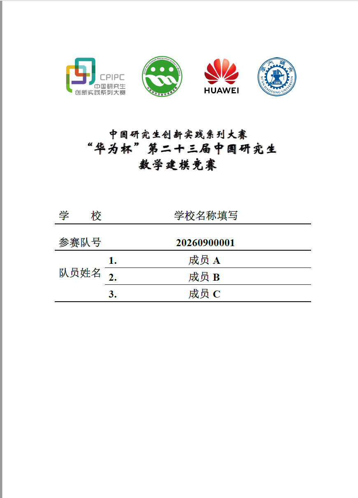
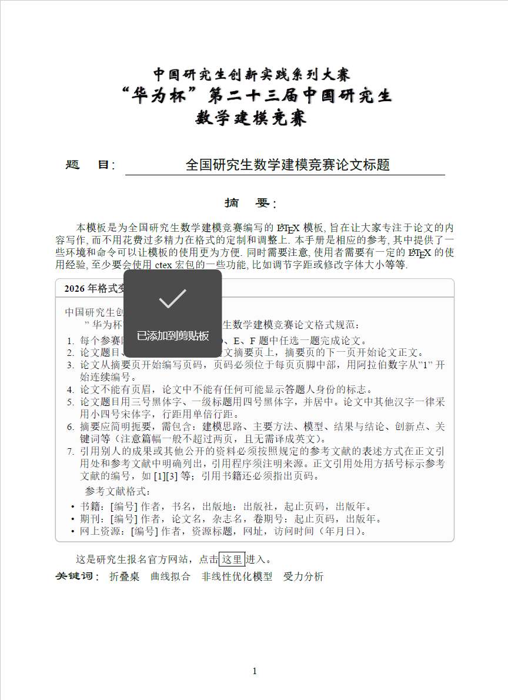

# 2026 华为杯研究生数学建模竞赛 LaTeX 模板

适用于“华为杯”第二十三届中国研究生数学建模竞赛，承办高校为西安交通大学。在已有 GMCMthesis 模板基础上更新，并参照 2026 年官方论文格式规范与官方 Word 模板调整封面、摘要页和正文格式。

> [!IMPORTANT]
> 本仓库是由个人整理、维护的非官方 LaTeX 适配模板，与赛事组委会、承办高校及相关企业不存在隶属、授权或背书关系。参赛时请始终以赛事组委会发布的最新通知、竞赛规则和官方模板为准。示例中的学校、成员、队号、摘要与正文必须替换为参赛者自己的内容。

## 预览

| 封面 | 摘要页 |
|---|---|
|  |  |

- [常规示例 PDF](example.pdf)
- [彩色表格示例 PDF](example-color.pdf)

## 编译

安装包含 XeLaTeX、latexmk、BibTeX 和中文支持的 TeX Live 或 MacTeX。在项目根目录执行：

```
latexmk -xelatex -interaction=nonstopmode -halt-on-error example.tex
latexmk -xelatex -interaction=nonstopmode -halt-on-error example-color.tex
```

也可以运行 `bash makefiles.sh`（macOS / Linux）或 `makefiles.bat`（Windows），一次编译两个示例。编译产物为 `example.pdf` 和 `example-color.pdf`。

项目已包含封面、标题所需的 PDF 素材，正常编译无需 Microsoft Word。请保留 `figures/` 目录，并从项目根目录运行编译命令。

### 字体

封面和摘要页固定字形已经嵌入 PDF 素材，包含华文行楷标题。正文根据系统选择字体；Windows 下使用 SimSun（宋体）和 SimHei（黑体），macOS 下使用 Songti SC 和 Heiti SC。

## 填写参赛信息

修改 `example.tex` 或 `example-color.tex` 中的以下字段：

```latex
\title{论文题目}
\baominghao{正式队伍编号}
\schoolname{学校名称}
\membera{成员一}
\memberb{成员二}
\memberc{成员三}
```

随后替换摘要、关键词、正文、参考文献及附录。示例摘要中的格式说明框也应替换为自己的内容。

## 2026 版调整

- 更新第二十三届赛事名称及西安交通大学校徽。
- 从官方 Word 模板提取封面 Logo 和标题 PDF，替换原第二十二届素材。
- 对齐页面尺寸、页边距和页脚位置；正文小四号宋体、论文题目三号黑体、一级标题四号黑体。
- 使用单倍行距，摘要后直接进入正文。
- 封面不显示页码，摘要从 1 开始连续编号。
- 附录代码展示：MATLAB 使用 Courier New 字体，Python 使用 Consolas 字体。

## 格式规范

- 论文题目：三号黑体，居中。
- 一级标题：四号黑体，居中。
- 正文汉字：小四号宋体，单倍行距。
- 页码：从摘要页开始，页脚居中，阿拉伯数字从 1 连续编号。
- 论文不能有页眉，不能有任何可能显示答题人身份的标志。
- 参考文献按正文中的引用次序列出，正文引用处用方括号标示，如 [1][3]。

## 目录

| 文件 | 用途 |
|---|---|
| `example.tex` / `example-color.tex` | 常规 / 彩色表格示例 |
| `gmcmthesis.cls` | 模板类文件 |
| `gmcm.bst` / `reference.bib` | 参考文献样式与示例文献 |
| `figures/` | 封面 Logo、标题 PDF 及示例插图 |
| `makefiles.sh` / `makefiles.bat` | 一键编译脚本 |

## 项目沿革与来源

本项目并非从零编写，主要来源及修改关系如下：

1. LaTeX 类文件与参考文献样式基于既有 **GMCMthesis** 模板继续修改；`gmcmthesis.cls` 中保留了 `latexstudio.net`、`andy123t`、`OsbertWang/GMCMthesis` 等原作者、维护者及相关贡献说明，`gmcm.bst` 中保留其原始版权声明。
2. 2026 年赛事名称、承办高校信息、封面与摘要页适配方式参考了 [Nopon-Knowledge/huawei-cup-modeling-latex](https://github.com/Nopon-Knowledge/huawei-cup-modeling-latex) 项目的公开说明与实现思路，并在此基础上结合本仓库的类文件、字体配置、代码环境和示例内容进行整理与调整。
3. 赛事格式要求、固定版式和相关图形素材以中国研究生创新实践系列大赛管理平台发布的 2026 年官方文件为依据；本仓库中的 PDF、图像及版式素材仅用于复现竞赛论文模板和帮助参赛者排版。

官方资料：

- [中国研究生创新实践系列大赛管理平台](https://cpipc.acge.org.cn/)
- [2026 年官方论文格式规范（DOCX）](https://cpipc.acge.org.cn/sysFile/downFile.do?fileId=97a93e3a9e074738aea95eea986508f2)
- [2026 年官方论文模板（DOCX）](https://cpipc.acge.org.cn/sysFile/downFile.do?fileId=a730b312331e492baad17b248bad6b51)

## 权利声明

本仓库仅用于学习、研究和竞赛排版交流，不代表官方发布版本。仓库所引用或包含的官方文件，以及“华为杯”赛事名称、赛事标识、华为相关名称与标识、西安交通大学名称与校徽等学校标识和其他企业、机构标识，其商标权、著作权及其他相关权利均归各自权利人所有。本仓库对这些名称、文件和标识的展示仅用于说明模板所适用的赛事及复现官方排版要求，不表示获得相关权利人的授权、认可或背书。

除另有明确说明外，请勿将上述官方文件、赛事标识、学校标识或企业标识用于与本赛事论文排版无关的用途；如权利人认为仓库内容存在不当使用，请通过仓库 Issue 联系维护者处理。
